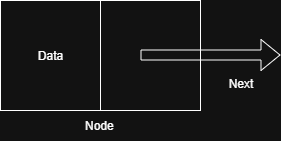

# Linked List

A **Linked List** is a linear data structure where elements are stored in **nodes**, and each node points to the **next** node in the sequence.

Unlike arrays, **linked lists are not stored in contiguous memory**.
---
## Types of Linked Lists

1. **Singly Linked List** – Each node has:
   - Data
   - A pointer to the next node

2. **Doubly Linked List** – Each node has:
   - Data
   - A pointer to the next node
   - A pointer to the previous node

3. **Circular Linked List** – The **last node connects back** to the head, forming a circle.

---
## When to Use a Linked List
- When you need **frequent insertion and deletion**
- When **random access is not required**  
  (Random access means directly accessing any element using an index, like in an array)
---
# Node
A **Node** is the building block of a linked list.  
Each node stores:

- **Data**: The actual value or information
- **Next**: A reference (pointer) to the **next node** in the list

---

# Singly Linked List

A **Singly Linked List** is a linear data structure where each node contains:

- **Data**
- A **pointer to the next node**

The list starts from a special node called the **head**, and ends when a node’s `next` pointer is `null`.

---

)

