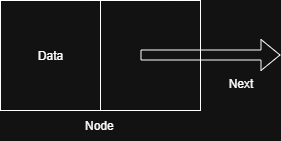

# Linked List

A **Linked List** is a linear data structure where elements are stored in **nodes**, and each node points to the **next** node in the sequence.

Unlike arrays, **linked lists are not stored in contiguous memory**.
---
## Types of Linked Lists

1. **Singly Linked List** – Each node has:
   - Data
   - A pointer to the next node

2. **Doubly Linked List** – Each node has:
   - Data
   - A pointer to the next node
   - A pointer to the previous node

3. **Circular Linked List** – The **last node connects back** to the head, forming a circle.

---
## When to Use a Linked List
- When you need **frequent insertion and deletion**
- When **random access is not required**  
  (Random access means directly accessing any element using an index, like in an array)
---
# Node
A **Node** is the building block of a linked list.  
Each node stores:

- **Data**: The actual value or information
- **Next**: A reference (pointer) to the **next node** in the list



---

# Singly Linked List

A **Singly Linked List** is a linear data structure where each node contains:

- **Data**
- A **pointer to the next node**
```java
   class Node{
   int data;
   Node next;
   Node(int data){
      this.data = data;
      this.next = null;
   }
}
```

The list starts from a special node called the **head**, and ends when a node’s `next` pointer is `null`.


---

# Doubly Linked List

A Doubly Linked List is a linear data structure where each node has three components:
 - **Data**
 - **Pointer** to the next node
 - **Pointer** to the Previous Node
This Structure allows traversal both in forward as well as backward direction, making it flexible than singly linked list.


This structure allows **traversal in both directions**:
- **Forward** (using `next`)
- **Backward** (using `prev`)

This makes it more flexible than a **Singly Linked List**, which only supports forward traversal.

```java
class Node {
    int data;
    Node next;
    Node prev;

    Node(int data) {
        this.data = data;
        this.next = null;
        this.prev = null;
    }
}
```


---

## Circular Linked List

A **Circular Linked List** is a variation of a linked list where the **last node does not point to `null`**.  
Instead, it points back to the **head (first node)**, forming a **circle or loop**.

- No node points to `null`
- The list can be **traversed infinitely** if not handled carefully
- You can start traversal from **any node** and still visit every element

Types of Circular Linked Lists:->
1. **Singly Circular Linked List**
   - Each node has:
     - **Data**
     - A pointer to the **next** node
   - The last node's `next` points to the **head**

2. **Doubly Circular Linked List**
   - Each node has:
     - **Data**
     - A pointer to the **next** node
     - A pointer to the **previous** node
   - The last node's `next` → head
   - The head's `prev` → last node

Use Cases->
- Round-robin scheduling
- Repeating playlists or slideshows
- Circular queues
- Token ring networks


---
