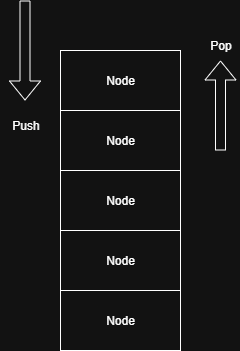

# Stack
Stack is a linear data structure that follows the LIFO (Last in First Out) Princinple.
  - The last element added to the stack is the first one to be removed.
  - Example: Stack of plates-> You place a new plate on top and remove from the top first.

**When to use**: 
-  Reverse Element -> ex: Reversing a string or linked list.
-  BackTracking Problems -> ex: Browsing History, undo features.
-  Expression Evaluation -> ex: Parsing Expressions like  ((a+b)*c).
-  Recursive Function Calls -> ex: Call Stack in recursion.
-  Depth First Search (DFS) in Graphs -> ex: Use a stack for traversal.

**Time Complexity**:
  - Push (Insert): **O(1)** [ Adding element at the top takes constant time ]
  - Pop (Remove): **O(1)** [ Removing the top element is also takes constant time ]
  - Peek (View Top): **O(1)** [ Accessing the top element is a single operation ]
  - Search : **O(n)** [ In the worst case we search the whole stack ]

***In Stack implementation, everything is inside one class, As it follows LIFO Princinple. The Design is very strict.***

The Stack class contains:-
  - A Node class to represent individual elements.
  - Methods like pop(), push(), peek(), print().
    
All these are self contained in a single class.

```java
class Node{
   int value;
   Node next;
   Node(int value){
    this.value = value;
  }  
 }
```


---

